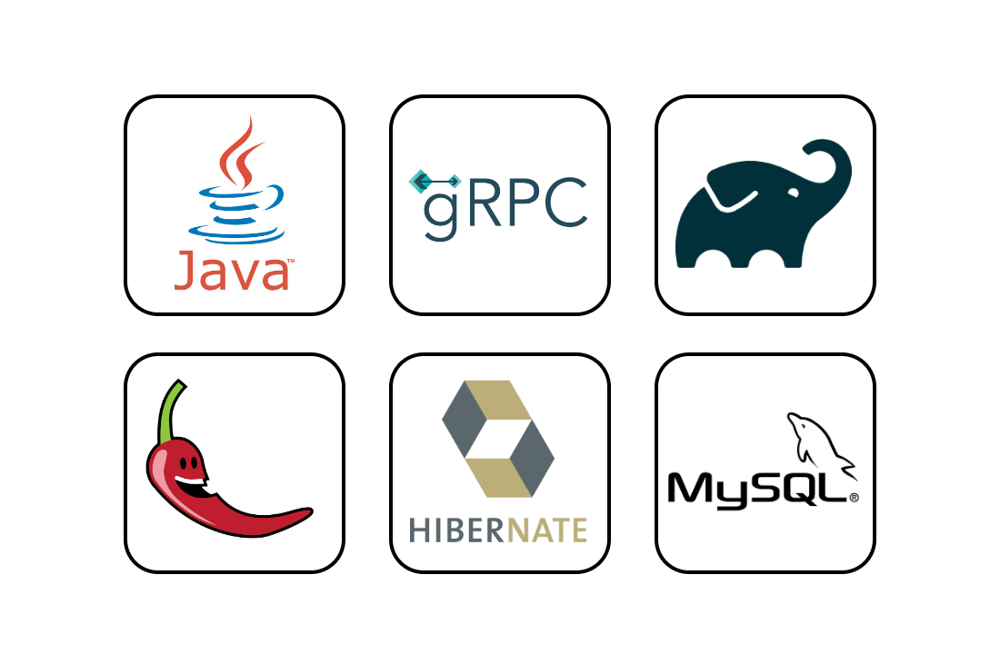
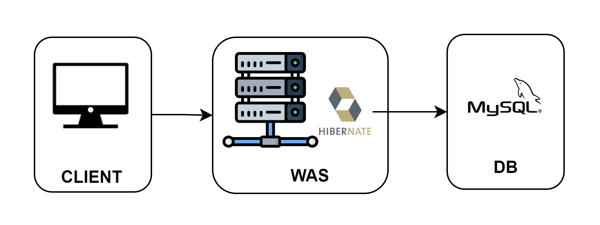

# LMS 프로그램 - gRPC

## Description
2021년 2학기 명지대학교 클라이언트서버 프로그래밍 강의에서 RMI 프로토콜을 이용하여  
구현한 LMS 프로그램을 gRPC 프로토콜로 구현한 프로그램입니다.

### <p align="center">Architecture</p>
프로젝트 안에는 3개의 모듈이 있습니다.
1. **grpc-common** : client와 server가 함께 공유하는 proto 파일 정의한 모듈
2. **grpc-client** : gRPC 클라이언트에 해당하는 모듈
3. **grpc-server** : gRPC 서버에 해당하는 모듈

RMI 프로토콜을 이용한 프로젝트에서는 client - server - data에 해당하는 세 개의 프로세스들을 각각 구현하였지만, 
본 프로젝트에서는 data에 해당하는 프로세스를 RDBMS로 전환하였고, Hibernate로 트랜잭션을 처리하였습니다.
***
**<p align="center">Project Structure</p>**
- grpc-common
````
main
 ├─java
 ├─proto
 └─resources
````
- grpc-client
````
main
  ├─generated
  ├─java
  │  ├─dto
  ├─exception
  │  └─util
  ├─proto
  └─resources
````
- grpc-server
````
main
  ├─generated
  ├─java
  │  ├─applicationservice
  │  ├─config
  │  ├─dto
  │  │  └─request
  │  ├─entity
  │  ├─exception
  │  └─repository
  ├─proto
  └─resources
````
***
**<p align="center">Stack</p>**

***
**<p align="center">Runtime View</p>**

***

## Environment
> SDK : Oracle OpenJDK version 17  
> 
> Build : Gradle 7.4  
> 
> DB : MySQL 8.0.28
> 
> Use Port: 8080
 
***

## Prerequisite
> JAVA  
> 
> Gradle  
> 
> MySQL

***

## Usage
`ServerGrpcMain.java`  

`ClientGrpcMain.java`